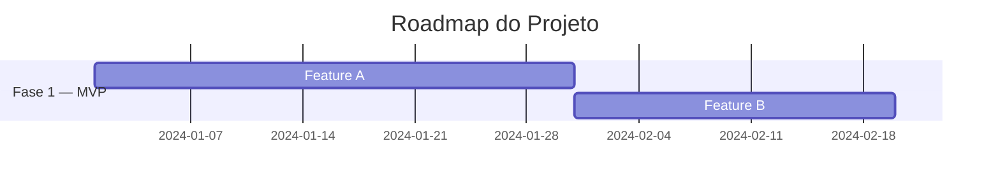
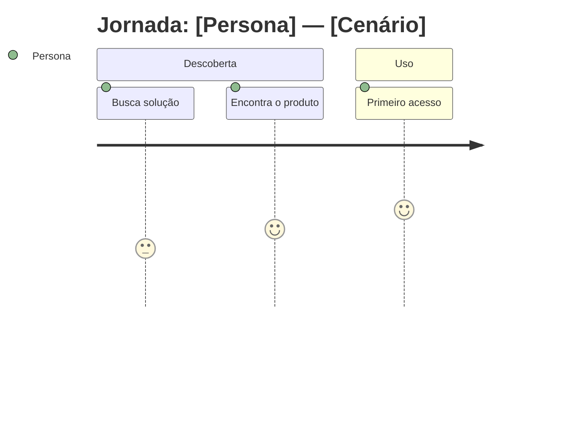
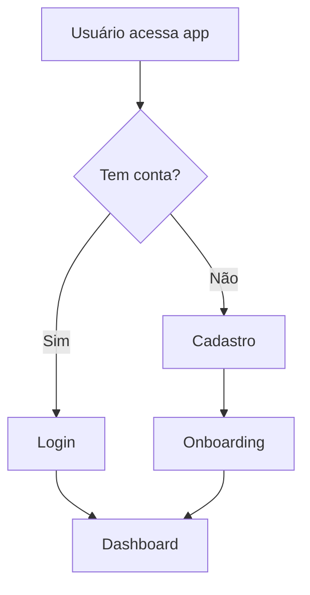
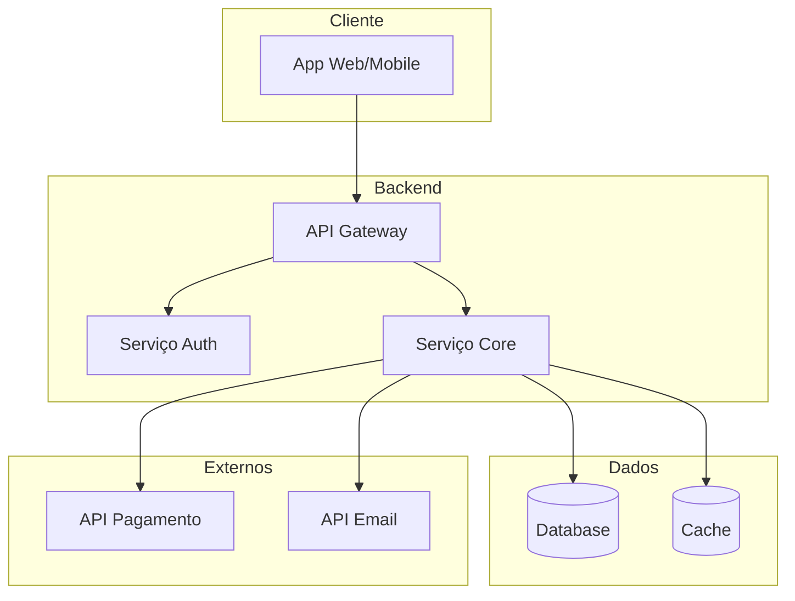
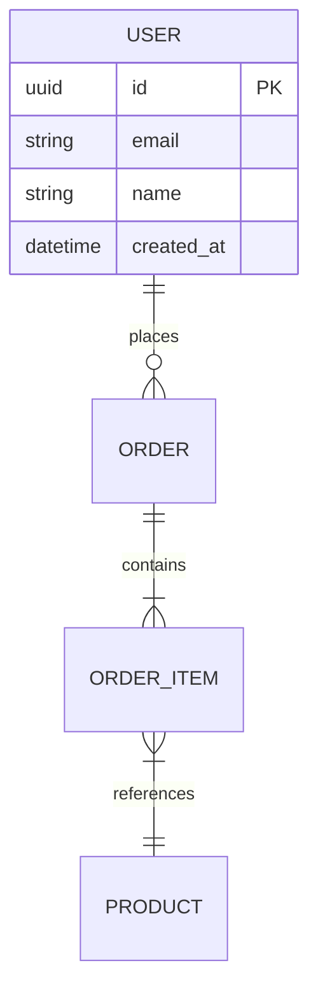

# Guia de Artefatos — Project Knowledge Hub

Este documento detalha a estrutura, conteúdo e boas práticas para cada artefato dos três pilares.

---

## Índice

1. [Pilar Produto](#pilar-produto)
   - PRD
   - Mapa de Funcionalidades
   - Roadmap
   - Métricas & KPIs
   - Análise Competitiva
   - Glossário
2. [Pilar Experiência](#pilar-experiência)
   - Personas
   - Mapa de Jornada
   - Service Blueprint
   - Branding
   - Design System
   - User Flows
   - Mapa de Stakeholders
   - Princípios de Design
3. [Pilar Tecnologia](#pilar-tecnologia)
   - Stack Técnica
   - Diagrama de Arquitetura
   - Mapa de Integrações
   - Estrutura do Repositório
   - Modelo de Dados
   - Estratégia de Deploy
   - ADRs

---

## Pilar Produto

### PRD (Product Requirements Document)

O PRD é o artefato central do pilar Produto. Ele responde "o quê estamos construindo e por quê".

**Estrutura:**

```
# PRD — [Nome do Projeto]

## 1. Visão do Produto
Uma frase que captura a essência do que o produto quer ser.

## 2. Problema
Qual dor ou oportunidade estamos endereçando. Ser específico — quem sofre, como sofre, o que acontece se não resolvermos.

## 3. Público-alvo
Resumo dos segmentos de usuários (detalhe completo fica no artefato Personas).

## 4. Objetivos
- Objetivo principal (north star)
- Objetivos secundários (3-5 max)
Cada objetivo deve ser mensurável.

## 5. Escopo
### 5.1 Incluso nesta versão
Lista clara do que entra.
### 5.2 Fora de escopo
O que conscientemente ficou de fora e por quê.

## 6. Requisitos Funcionais
Organizados por módulo/feature area. Usar formato:
- **RF-001:** [Descrição] — Prioridade: [Alta/Média/Baixa]

## 7. Requisitos Não-Funcionais
Performance, segurança, acessibilidade, i18n, etc.

## 8. Restrições e Premissas
O que estamos assumindo como verdade e o que limita nossas escolhas.

## 9. Riscos
Riscos identificados com impacto e mitigação.

## 10. Critérios de Sucesso
Como saberemos que o produto está funcionando.
```

**Dicas:**
- O PRD deve ser compreensível por qualquer stakeholder, não apenas técnicos.
- Evite jargão técnico no PRD — detalhes de implementação ficam no pilar Tecnologia.
- Conecte cada requisito funcional a um objetivo do produto.

---

### Mapa de Funcionalidades

Lista estruturada de todas as features do produto com priorização.

**Estrutura:**

```
# Mapa de Funcionalidades — [Nome do Projeto]

## Método de Priorização: MoSCoW

### Must Have (essencial para lançamento)
| ID | Feature | Descrição | Módulo | Persona |
|---|---|---|---|---|
| F-001 | [Nome] | [O que faz] | [Área] | [Quem usa] |

### Should Have (importante, mas não bloqueia lançamento)
[mesma tabela]

### Could Have (desejável se houver tempo/recurso)
[mesma tabela]

### Won't Have (fora de escopo — por agora)
[mesma tabela]
```

**Alternativas de priorização:** Se MoSCoW não fizer sentido, usar RICE (Reach, Impact, Confidence, Effort) ou Impact vs Effort matrix. Adapte ao contexto do projeto.

---

### Roadmap

**Estrutura:**

```
# Roadmap — [Nome do Projeto]

## Fase 1: [Nome] (Mês X — Mês Y)
**Tema:** [Foco principal desta fase]
- Feature A
- Feature B
**Milestone:** [Entregável concreto]

## Fase 2: [Nome] (Mês Y — Mês Z)
[mesmo formato]
```

Pode usar Mermaid para timeline visual:


---

### Métricas & KPIs

```
# Métricas & KPIs — [Nome do Projeto]

## North Star Metric
[A métrica que mais importa e por quê]

## KPIs Primários
| Métrica | Definição | Meta | Frequência |
|---|---|---|---|

## KPIs Secundários
[mesma tabela]

## Como medir
[Ferramentas, eventos, queries]
```

---

### Análise Competitiva

```
# Análise Competitiva — [Nome do Projeto]

## Mercado
[Contexto do segmento]

## Competidores
| Aspecto | [Nosso Produto] | Competidor A | Competidor B |
|---|---|---|---|
| Preço | | | |
| Feature X | | | |
| UX | | | |

## Diferencial
[O que nos torna únicos]

## Oportunidades
[Gaps que nenhum competidor endereça bem]
```

---

### Glossário

```
# Glossário — [Nome do Projeto]

| Termo | Definição | Contexto |
|---|---|---|
| [Termo] | [O que significa] | [Onde/como é usado no projeto] |
```

Inclua termos de negócio, termos técnicos que o time de produto precisa entender, e abreviações.

---

## Pilar Experiência

### Personas

**Estrutura por persona:**

```
# Personas — [Nome do Projeto]

## Persona 1: [Nome Fictício]

**Perfil demográfico:**
- Idade: [faixa]
- Ocupação: [cargo/atividade]
- Contexto: [situação de vida relevante]

**Goals (o que quer alcançar):**
1. [Goal principal]
2. [Goal secundário]

**Frustrações (pain points):**
1. [Frustração com soluções atuais]
2. [Barreira para alcançar goals]

**Comportamentos:**
- [Como busca soluções hoje]
- [Padrões de uso digital relevantes]

**Cenário de uso:**
> [Narrativa curta: um dia na vida desta persona usando o produto]

**Citação representativa:**
> "[Frase que captura a mentalidade desta persona]"
```

**Dicas:**
- 2-4 personas é o ideal. Mais que isso dilui o foco.
- Personas devem ser baseadas em dados reais quando possível (pesquisas, entrevistas, analytics).
- Cada persona deve ter necessidades distintas o suficiente para justificar sua existência.

---

### Mapa de Jornada do Usuário

**Estrutura:**

```
# Jornada do Usuário — [Persona]: [Cenário]

## Estágios da Jornada

### 1. [Estágio] (ex: Descoberta)
- **Ações:** O que a persona faz
- **Pensamentos:** O que está pensando
- **Emoções:** 😊 😐 😤 (usar escala simples)
- **Touchpoints:** Onde a interação acontece
- **Oportunidades:** Como podemos melhorar este momento

### 2. [Estágio] (ex: Consideração)
[mesmo formato]

### 3. [Estágio] (ex: Ação/Conversão)
[mesmo formato]

### 4. [Estágio] (ex: Pós-uso/Retenção)
[mesmo formato]
```

Gere uma jornada por persona principal. Pode complementar com versão Mermaid:


---

### Service Blueprint

O Service Blueprint é o artefato mais completo do pilar Experiência. Ele conecta a experiência do usuário com os processos internos.

**Estrutura:**

```
# Service Blueprint — [Nome do Projeto]

## Cenário: [Jornada/fluxo sendo mapeado]

| Camada | Etapa 1 | Etapa 2 | Etapa 3 | Etapa N |
|---|---|---|---|---|
| **Evidências Físicas** | [O que o usuário vê: UI, email, notificação] | | | |
| **Ações do Usuário** | [O que o usuário faz] | | | |
| **Linha de Interação** | ─────── | ─────── | ─────── | ─────── |
| **Front-stage (visível)** | [Processos visíveis ao usuário] | | | |
| **Linha de Visibilidade** | ─────── | ─────── | ─────── | ─────── |
| **Back-stage (invisível)** | [Processos internos não vistos pelo usuário] | | | |
| **Linha de Interação Interna** | ─────── | ─────── | ─────── | ─────── |
| **Processos de Suporte** | [Sistemas, APIs, infra que sustentam] | | | |

## Pontos de Falha 🔴
[Onde o serviço pode quebrar]

## Pontos de Espera ⏳
[Onde o usuário precisa aguardar]

## Oportunidades de Melhoria 💡
[Insights derivados do blueprint]
```

**Dicas:**
- Mapeie pelo menos um blueprint para o fluxo principal do produto.
- Os pontos de falha são o ouro deste artefato — é onde design e engenharia se encontram.
- Conecte os "Processos de Suporte" com o pilar Tecnologia (integrações, APIs).

---

### Branding

O Branding documenta a identidade visual e verbal da marca do projeto. É a referência central para
garantir consistência em todos os touchpoints — do app ao material de marketing.

**Estrutura:**

```
# Branding — [Nome do Projeto]

## 1. Essência da Marca

### Propósito
[Por que esta marca existe — além de lucrar]

### Personalidade
[Se a marca fosse uma pessoa, como ela seria?]
- Traço 1: [ex: Aventureira — gosta de explorar, não tem medo do novo]
- Traço 2: [ex: Confiável — faz o que promete, sem surpresas]
- Traço 3: [ex: Acessível — fala com clareza, sem elitismo]

### Tom de Voz
- **Formal ←→ Casual:** [posição na escala, ex: 70% casual]
- **Sério ←→ Divertido:** [posição]
- **Técnico ←→ Simples:** [posição]

**Exemplo de tom:**
> ✅ Assim: "[frase no tom correto]"
> ❌ Não assim: "[frase no tom errado]"

## 2. Logo

### Versão Principal
[Descrição da logo. Se houver arquivo, referenciar: `assets/logo-principal.svg`]

### Variações
| Variação | Uso | Arquivo |
|---|---|---|
| Principal | Fundos claros | `assets/logo-principal.svg` |
| Invertida | Fundos escuros | `assets/logo-invertida.svg` |
| Ícone/Favicon | Espaços reduzidos | `assets/logo-icon.svg` |
| Monocromática | Impressão P&B | `assets/logo-mono.svg` |

### Área de proteção
[Espaço mínimo ao redor da logo — geralmente medido em unidades da própria logo]

### Uso incorreto
[O que NÃO fazer: distorcer, mudar cores, adicionar sombra, etc.]

## 3. Paleta de Cores

### Cores Primárias
| Nome | Hex | RGB | Uso |
|---|---|---|---|
| [ex: Acid Lemon] | #D4FF00 | 212, 255, 0 | Destaque, CTAs, elementos interativos |
| [ex: Dark Base] | #0A0A0A | 10, 10, 10 | Fundos, texto principal |

### Cores Secundárias
| Nome | Hex | RGB | Uso |
|---|---|---|---|
| [ex: Soft Gray] | #F5F5F5 | 245, 245, 245 | Fundos secundários, cards |

### Cores Semânticas
| Função | Hex | Uso |
|---|---|---|
| Success | #22C55E | Confirmações, sucesso |
| Warning | #F59E0B | Alertas, atenção |
| Error | #EF4444 | Erros, destrutivos |
| Info | #3B82F6 | Informativo, links |

### Acessibilidade
[Contraste mínimo: WCAG AA (4.5:1 para texto, 3:1 para texto grande)]
[Listar combinações que passam e que não passam no contraste]

## 4. Tipografia

### Família Tipográfica
| Tipo | Fonte | Peso | Uso |
|---|---|---|---|
| Display/Headings | [ex: Inter] | Bold (700) | Títulos, hero text |
| Body | [ex: Inter] | Regular (400) | Texto corrido, parágrafos |
| Monospace | [ex: JetBrains Mono] | Regular (400) | Código, dados técnicos |

### Escala Tipográfica
| Nível | Tamanho | Line Height | Uso |
|---|---|---|---|
| H1 | 48px / 3rem | 1.2 | Títulos de página |
| H2 | 36px / 2.25rem | 1.25 | Seções principais |
| H3 | 24px / 1.5rem | 1.3 | Subseções |
| H4 | 20px / 1.25rem | 1.4 | Labels, subtítulos |
| Body | 16px / 1rem | 1.6 | Texto corrido |
| Small | 14px / 0.875rem | 1.5 | Captions, helpers |
| XSmall | 12px / 0.75rem | 1.4 | Labels mínimos, badges |

### Fonte de carregamento
[CDN, self-hosted, variável? Ex: Google Fonts, Adobe Fonts, local]

## 5. Iconografia

### Biblioteca de Ícones
[Qual biblioteca: Lucide, Phosphor, Heroicons, custom, etc.]
- **Estilo:** [Outline / Filled / Duotone]
- **Tamanho base:** [ex: 24px]
- **Stroke width:** [ex: 1.5px]

### Ícones Custom
[Se existirem ícones próprios, listar com descrição e referência ao arquivo]

## 6. Imagery / Estilo Visual

### Fotografia
[Estilo fotográfico: natural, editorial, lifestyle, etc.]
[Filtros ou tratamento padrão, se houver]

### Ilustrações
[Estilo de ilustração, se aplicável]

### Grafismos
[Elementos gráficos de apoio: patterns, shapes, texturas]

## 7. Assets e Arquivos

| Asset | Formato | Localização |
|---|---|---|
| Logo (todas variações) | SVG, PNG | `assets/brand/logos/` |
| Paleta (Figma/tokens) | JSON, Figma | `assets/brand/tokens/` |
| Fontes | WOFF2, TTF | `assets/brand/fonts/` |
| Ícones custom | SVG | `assets/brand/icons/` |
| Brand Guide (PDF) | PDF | `assets/brand/guide.pdf` |
```

**Dicas:**
- Mesmo que o projeto não tenha branding formal, documente o que existe — cores do CSS, fonte usada, logo no repo. Isso já é valioso.
- Se houver um arquivo Figma de branding, referencie o link. O Figma MCP do Antigravity pode ser usado para extrair tokens.
- Conecte a paleta de cores e tipografia com o Design System — eles compartilham os mesmos tokens.

---

### Design System

O Design System documenta todos os componentes de UI do projeto seguindo a metodologia **Atomic Design**.
Ele é a ponte entre o Branding (identidade visual) e a implementação (código dos componentes).

**Estrutura:**

```
# Design System — [Nome do Projeto]

## 1. Fundamentos (Design Tokens)

Os tokens são os valores primitivos que alimentam todos os componentes.
Eles conectam o Branding ao código.

### Cores
[Referência ao artefato de Branding — usar os mesmos valores]
Tokens: `--color-primary`, `--color-secondary`, `--color-success`, etc.

### Tipografia
[Referência ao artefato de Branding]
Tokens: `--font-display`, `--font-body`, `--font-mono`
Escalas: `--text-xs` a `--text-4xl`

### Espaçamento
| Token | Valor | Uso |
|---|---|---|
| --space-1 | 4px | Mínimo — entre ícone e label |
| --space-2 | 8px | Compact — padding interno small |
| --space-3 | 12px | Tight — gaps em listas |
| --space-4 | 16px | Base — padding padrão |
| --space-6 | 24px | Relaxed — entre seções |
| --space-8 | 32px | Loose — margens de seção |
| --space-12 | 48px | Spacious — entre blocos |
| --space-16 | 64px | Expansive — hero, headers |

### Border Radius
| Token | Valor | Uso |
|---|---|---|
| --radius-sm | 4px | Badges, tags |
| --radius-md | 8px | Cards, inputs |
| --radius-lg | 12px | Modais, containers |
| --radius-full | 9999px | Avatares, pills |

### Sombras
| Token | Valor | Uso |
|---|---|---|
| --shadow-sm | 0 1px 2px rgba(0,0,0,0.05) | Cards sutis |
| --shadow-md | 0 4px 6px rgba(0,0,0,0.07) | Cards elevados, dropdowns |
| --shadow-lg | 0 10px 15px rgba(0,0,0,0.1) | Modais, popovers |

### Breakpoints
| Token | Valor | Dispositivo |
|---|---|---|
| --bp-sm | 640px | Mobile landscape |
| --bp-md | 768px | Tablet |
| --bp-lg | 1024px | Desktop |
| --bp-xl | 1280px | Desktop wide |

## 2. Átomos

Átomos são os elementos mais básicos e indivisíveis da interface.
Não fazem sentido sozinhos, mas são os blocos de construção de tudo.

### Button

| Propriedade | Variantes |
|---|---|
| Variante | Primary, Secondary, Ghost, Destructive, Link |
| Tamanho | sm (32px), md (40px), lg (48px) |
| Estado | Default, Hover, Active, Focus, Disabled, Loading |
| Ícone | Nenhum, Left, Right, Icon-only |

**Anatomia:**
- Padding: `--space-2` vertical, `--space-4` horizontal
- Border-radius: `--radius-md`
- Font: `--font-body` weight 500
- Transição: 150ms ease

### Input

| Propriedade | Variantes |
|---|---|
| Tipo | Text, Email, Password, Number, Search, Textarea |
| Estado | Default, Focus, Error, Disabled, Readonly |
| Adornos | Nenhum, Ícone esquerdo, Ícone direito, Prefixo, Sufixo |

### Badge / Tag
[Variantes: status (success, warning, error, info), tamanhos, dismissable]

### Avatar
[Variantes: tamanhos (xs, sm, md, lg, xl), com imagem, com iniciais, fallback]

### Icon
[Referência à biblioteca, tamanhos, cores]

### Typography Components
[Heading, Paragraph, Label, Caption, Code — com variantes de tamanho e peso]

### Outros Átomos
[Checkbox, Radio, Toggle/Switch, Spinner/Loader, Divider, Tooltip trigger]

## 3. Moléculas

Moléculas combinam átomos para formar componentes funcionais.

### Form Field
Composição: Label + Input + Helper Text + Error Message
```
┌─ Label ──────────────────┐
│ ┌─ Input ──────────────┐ │
│ │                      │ │
│ └──────────────────────┘ │
│ Helper text / Error msg  │
└──────────────────────────┘
```

### Search Bar
Composição: Input (search) + Icon (search) + Button (clear)

### Card Header
Composição: Avatar + Title + Subtitle + Action Button

### Navigation Item
Composição: Icon + Label + Badge (optional)

### Price Display
Composição: Currency + Value + Discount Badge (optional)

### Empty State
Composição: Illustration + Heading + Description + Action Button

### Outros Moléculas
[Breadcrumb, Pagination controls, Tab item, Dropdown trigger + menu]

## 4. Organismos

Organismos são componentes complexos que formam seções distintas da interface.

### Header / Navigation Bar
Composição: Logo + Nav Items + Search Bar + User Menu + Cart Badge
[Variantes: Desktop, Mobile (hamburger), Sticky, Transparent]

### Product Card
Composição: Image + Badge (sale/new) + Title + Price Display + Add to Cart Button
[Variantes: Grid, List, Compact, Featured]

### Form (completo)
Composição: Heading + Form Fields + Validation Summary + Submit Button + Secondary Action
[Exemplos: Login, Cadastro, Checkout, Contato]

### Cart / Order Summary
Composição: Item List + Quantity Controls + Price Subtotals + Coupon Input + Total + CTA

### Footer
Composição: Logo + Nav Columns + Social Links + Newsletter Form + Legal

### Modal / Dialog
Composição: Overlay + Header + Body + Footer (Actions)
[Variantes: Confirmation, Form, Alert, Full-screen]

### Outros Organismos
[Hero Section, Testimonials, FAQ Accordion, Data Table, Filter Panel]

## 5. Templates

Templates definem o layout da página — a estrutura onde os organismos se encaixam.

### Template: Página de Listagem
```
┌─ Header ─────────────────────────┐
├─ Breadcrumb ─────────────────────┤
├─ Page Title + Filter Controls ───┤
├──────────────────────────────────┤
│ Sidebar    │ Product Grid        │
│ (Filters)  │ (Product Cards)     │
│            │                     │
│            │                     │
├────────────┼─────────────────────┤
│            │ Pagination          │
├─ Footer ─────────────────────────┤
└──────────────────────────────────┘
```

### Template: Página de Detalhe
```
┌─ Header ─────────────────────────┐
├─ Breadcrumb ─────────────────────┤
├──────────────────────────────────┤
│ Image Gallery  │ Product Info    │
│                │ (Title, Price,  │
│                │  Options, CTA)  │
├──────────────────────────────────┤
│ Tabs: Descrição | Avaliações     │
├──────────────────────────────────┤
│ Related Products (Carousel)      │
├─ Footer ─────────────────────────┤
└──────────────────────────────────┘
```

### Template: Checkout
```
┌─ Header (simplificado) ──────────┐
├──────────────────────────────────┤
│ Steps Indicator (1-2-3-4)        │
├──────────────────────────────────┤
│ Form Area       │ Order Summary  │
│ (Login /        │ (Cart items,   │
│  Endereço /     │  Totals,       │
│  Pagamento)     │  Coupon)       │
├─ Footer (mínimo) ────────────────┤
└──────────────────────────────────┘
```

[Adicionar mais templates conforme o projeto exigir]

## 6. Páginas

Páginas são instâncias concretas dos templates, preenchidas com dados reais ou representativos.

[Listar as páginas principais do projeto com referência ao template que usam]

| Página | Template | URL | Status |
|---|---|---|---|
| Home | Custom | / | Implementada |
| Listagem de Produtos | Listagem | /produtos | Implementada |
| Detalhe do Produto | Detalhe | /produto/:id | Implementada |
| Carrinho | Custom | /carrinho | Em desenvolvimento |
| Checkout | Checkout | /checkout | Planejada |

## 7. Padrões de Interação

### Feedback ao Usuário
[Como o sistema comunica: toasts, modais, inline messages, loading states]

### Animações e Transições
- Duração padrão: [ex: 200ms]
- Easing: [ex: ease-out para entradas, ease-in para saídas]
- Elementos que animam: [botões, cards, modais, page transitions]

### Responsividade
[Estratégia: mobile-first? Breakpoints? Comportamento de componentes em cada breakpoint]

## 8. Implementação

### Tecnologia de componentes
[React, Vue, Web Components, etc.]

### Onde vive o design system
| Ferramenta | URL/Path | Propósito |
|---|---|---|
| Figma | [link] | Source of truth visual |
| Storybook | [URL] | Documentação interativa |
| Código | [path no repo] | Implementação |
| Tokens | [path/format] | Design tokens (JSON/CSS) |

### Convenções de nomenclatura
- Componentes: [PascalCase — ex: ProductCard]
- Tokens CSS: [kebab-case com prefixo — ex: --color-primary]
- Classes: [BEM, Tailwind utility, CSS Modules — qual padrão]
```

**Dicas:**
- Nem todo projeto precisa de todos os componentes listados. Documente o que existe e o que está planejado.
- Se o projeto usa Tailwind, os tokens podem ser mapeados para o tailwind.config.
- O Figma MCP pode ser usado para extrair componentes diretamente do arquivo de design.
- Comece pelos átomos e moléculas mais usados — geralmente Button, Input, Card e Form Field cobrem 80% da UI.
- Para projetos em estágio inicial, documente pelo menos os tokens (cores, tipografia, espaçamento) e os 5 componentes mais usados. O resto pode ser adicionado incrementalmente.
- Conecte cada componente ao Branding — cores, fontes e espaçamentos devem vir dos mesmos tokens.

---

### User Flows

Diagramas de decisão para fluxos críticos. Preferir Mermaid:



Gerar um flow para cada fluxo crítico identificado no PRD ou na jornada.

---

### Mapa de Stakeholders

```
# Stakeholders — [Nome do Projeto]

## Matriz Influência x Interesse

### Alta Influência + Alto Interesse (Gerir de perto)
- [Stakeholder]: [Papel] — [O que precisa saber/aprovar]

### Alta Influência + Baixo Interesse (Manter satisfeito)
- [Stakeholder]: [Papel]

### Baixa Influência + Alto Interesse (Manter informado)
- [Stakeholder]: [Papel]

### Baixa Influência + Baixo Interesse (Monitorar)
- [Stakeholder]: [Papel]
```

---

### Princípios de Design

```
# Princípios de Design — [Nome do Projeto]

## 1. [Princípio] (ex: "Simplifique a decisão")
**O que significa:** [Explicação]
**Na prática:** [Exemplo concreto de aplicação no projeto]
**O que evitar:** [Anti-pattern]

## 2. [Princípio]
[mesmo formato]
```

3-5 princípios é o ideal. Devem ser específicos o suficiente para guiar decisões reais, não genéricos como "ser fácil de usar".

---

## Pilar Tecnologia

### Stack Técnica

```
# Stack Técnica — [Nome do Projeto]

## Frontend
| Tecnologia | Versão | Propósito |
|---|---|---|
| [ex: Next.js] | [14.x] | [Framework principal] |

## Backend
| Tecnologia | Versão | Propósito |
|---|---|---|

## Banco de Dados
| Tecnologia | Tipo | Propósito |
|---|---|---|

## Infraestrutura
| Serviço | Provider | Propósito |
|---|---|---|

## Ferramentas de Desenvolvimento
| Ferramenta | Propósito |
|---|---|

## Justificativa das Escolhas
[Por que esta stack e não outra — conectar com requisitos do PRD]
```

---

### Diagrama de Arquitetura

Usar Mermaid para gerar diagrama legível:



Adaptar ao projeto real. Incluir todos os componentes relevantes.

---

### Mapa de Integrações

```
# Integrações — [Nome do Projeto]

## Integrações Ativas

### [Nome da Integração] (ex: Stripe)
- **Tipo:** API REST / Webhook / SDK
- **Propósito:** [O que resolve]
- **Fluxo de dados:** [De onde → para onde]
- **Autenticação:** [API Key / OAuth / etc]
- **Endpoints principais:**
  - `POST /charges` — Criar cobrança
  - `POST /webhooks` — Receber notificações
- **Fallback:** [O que acontece se cair]
- **Docs:** [Link para documentação]

### [Próxima integração]
[mesmo formato]

## Integrações Planejadas
[Lista com timeline]
```

---

### Estrutura do Repositório

```
# Estrutura do Repositório — [Nome do Projeto]

## Organização

\`\`\`
projeto/
├── src/
│   ├── app/          # Rotas e páginas
│   ├── components/   # Componentes reutilizáveis
│   ├── lib/          # Utilitários e helpers
│   ├── services/     # Comunicação com APIs
│   └── types/        # Definições de tipos
├── public/           # Assets estáticos
├── tests/            # Testes
├── docs/             # Documentação (gerada por esta skill)
└── infra/            # Configuração de infra
\`\`\`

## Convenções
- Nomenclatura de arquivos: [kebab-case / camelCase / etc]
- Branches: [gitflow / trunk-based / etc]
- Commits: [conventional commits / livre / etc]
```

Adaptar à realidade do projeto — investigar o repo se disponível.

---

### Modelo de Dados

Usar Mermaid ERD:



Incluir apenas entidades principais e seus relacionamentos. Não precisa ser o schema completo do banco.

---

### Estratégia de Deploy

```
# Deploy — [Nome do Projeto]

## Ambientes
| Ambiente | URL | Propósito | Deploy |
|---|---|---|---|
| Dev | localhost | Desenvolvimento local | Manual |
| Staging | staging.exemplo.com | Testes e QA | CI/CD |
| Produção | app.exemplo.com | Usuários finais | CI/CD |

## Pipeline CI/CD
[Descrever ou diagramar o fluxo]

## Monitoramento
- [Ferramentas: Sentry, Datadog, etc]
- [Alertas configurados]

## Rollback
[Processo de rollback]
```

---

### ADRs (Architecture Decision Records)

```
# ADR-001: [Título da Decisão]

**Status:** Aceita | Proposta | Substituída
**Data:** YYYY-MM-DD

## Contexto
[Qual situação levou a esta decisão]

## Decisão
[O que foi decidido]

## Alternativas Consideradas
1. [Alternativa A] — [Prós e contras]
2. [Alternativa B] — [Prós e contras]

## Consequências
- **Positivas:** [O que ganhamos]
- **Negativas:** [O que perdemos ou complicamos]
- **Riscos:** [O que pode dar errado]
```

Criar um ADR para cada decisão técnica significativa. Se o projeto está começando, as decisões de stack já rendem pelo menos um ADR.
